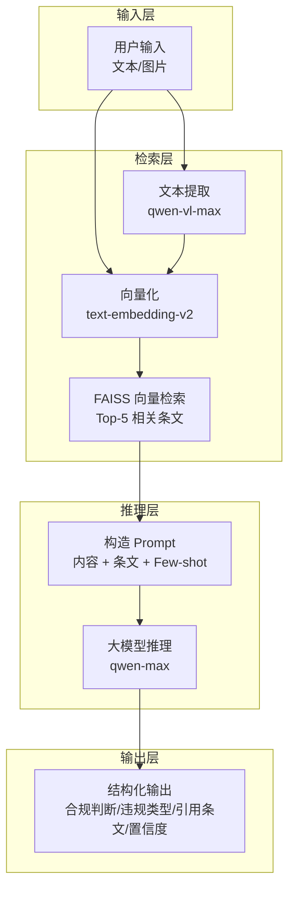
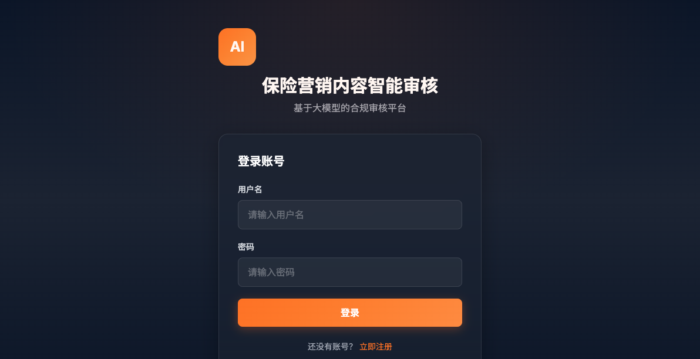
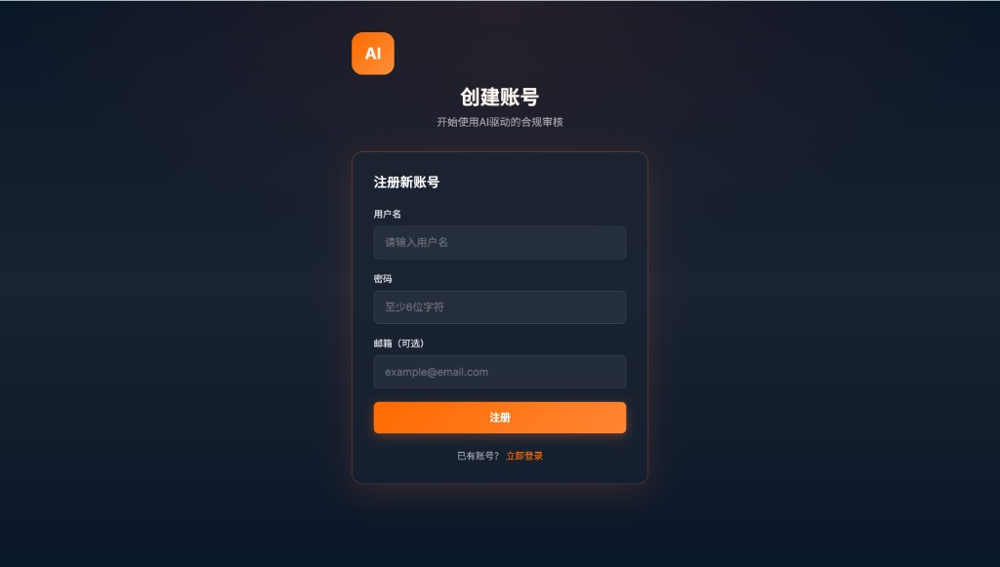
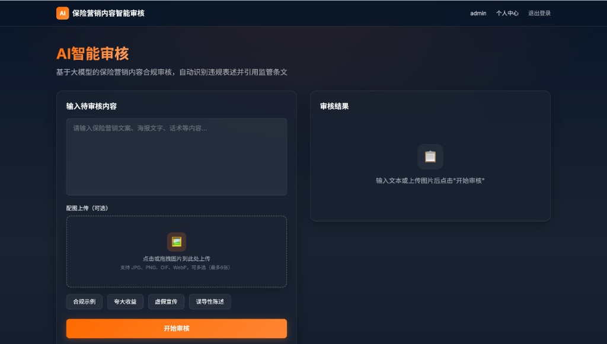
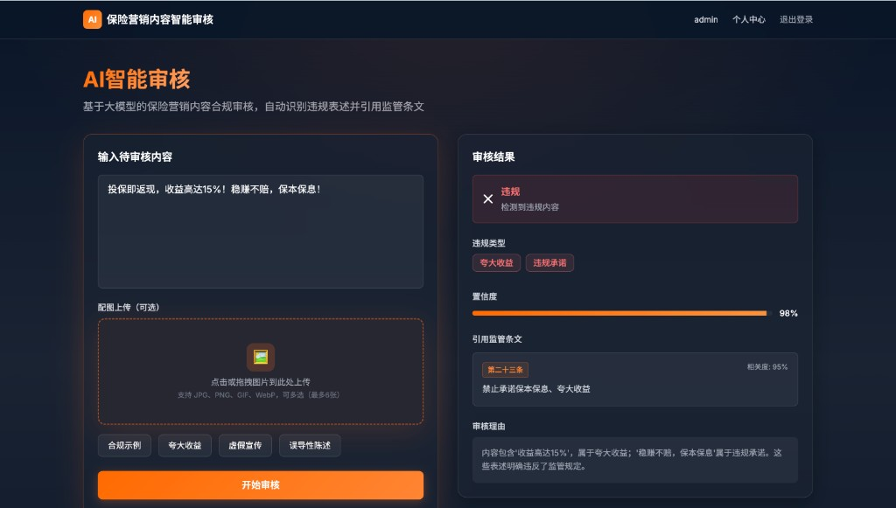
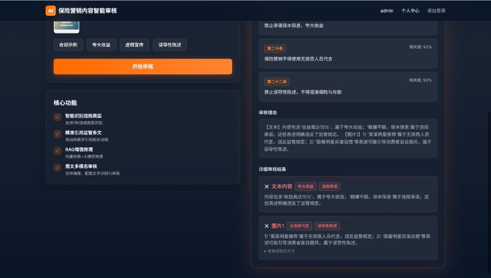
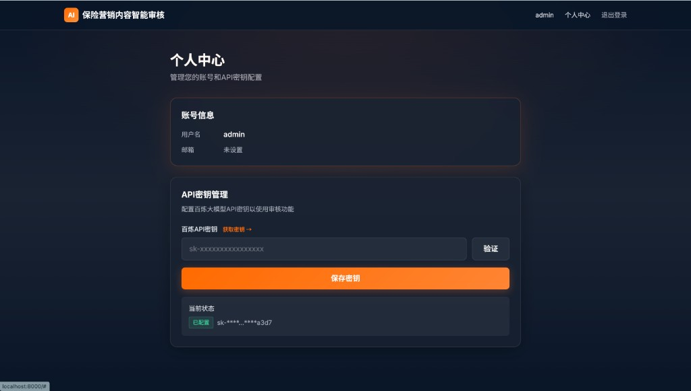

# 保险营销内容智能审核系统

> 基于大模型的保险营销内容合规审核系统，自动判断营销文案、海报、话术等是否违规


## ✨ 核心功能

- ✅ **自动合规判断**：输入营销内容，自动判断是否违规
- ✅ **违规类型识别**：识别7种违规类型（夸大收益、虚假宣传等），支持多违规类型同时检测
- ✅ **引用监管条文**：精准引用具体条文编号和原文
- ✅ **置信度评分**：给出0-1之间的置信度
- ✅ **多模态支持**：支持文本和图文内容审核（Web界面支持图片上传）
- ✅ **逐张图片审核**：上传多张图片时，分别显示每张图片的审核结果（合规/违规、违规类型、理由）
- ✅ **RAG增强**：向量检索相关监管条文，提升准确率
- ✅ **完整知识库**：包含3篇核心监管文档，共134条监管条文

## 🛠️ 技术栈

- **Python 3.9+** - 核心语言
- **百炼大模型 API（Dashscope）** - qwen-max + text-embedding-v2
- **FAISS-CPU** - 向量检索，无需 GPU
- **FastAPI + Uvicorn** - 轻量 Web 服务
- **Tailwind CSS（CDN）** - 纯 HTML 前端，无需 Node.js 构建

## 📋 需求实现对照

本项目完整实现了考核要求的所有功能：

| 需求项 | 实现方式 | 说明 |
|--------|---------|------|
| 文本/图文输入 | ✅ | 支持纯文本、单图、多图混合审核 |
| 输出合规判断 | ✅ | 返回 compliance: true/false |
| 违规类型识别 | ✅ | 支持7种违规类型，可同时识别多种 |
| 引用条文编号 | ✅ | 精确引用条文ID、原文、相关度评分 |
| 百炼大模型 | ✅ | qwen-max + qwen-vl-max + text-embedding-v2 |
| RAG增强 | ✅ | FAISS向量检索 + 相似度匹配 |
| Prompt Engineering | ✅ | 精心设计的系统提示词和Few-shot示例 |
| 效果评估 | ✅ | 完整的评估模块，支持准确率/召回率/F1 |
| 三篇监管文档 | ✅ | 完整解析并构建知识库（134条监管条文）|

## ⚡ 快速开始（3步启动）

### 环境要求

- **Python**：3.9 及以上
- **操作系统**：macOS、Linux、Windows（需 Git Bash 或 WSL）
- **网络**：可访问阿里云 Dashscope API
- **磁盘**：约 500MB（含依赖与向量库）

### 启动步骤

```bash
# 1. 克隆项目
git clone https://github.com/mzwei09/insurance-content-review-system.git
cd insurance-content-review-system

# 2. 一键启动（自动安装依赖、初始化数据库、构建知识库、启动服务）
bash start.sh

# 3. 浏览器访问 http://localhost:8000 🎉
```

> 💡 **提示**：如果你 fork 了这个项目，请将上面的 `mzwei09` 替换为你的 GitHub 用户名

### 验证步骤

启动成功后，可按以下步骤验证：

1. **健康检查**：访问 http://localhost:8000/api/health，应返回 `{"status":"ok"}`
2. **API 文档**：访问 http://localhost:8000/docs，可查看完整接口文档
3. **前端界面**：访问 http://localhost:8000，注册并登录后配置 API 密钥，即可开始审核

### 常见启动错误

| 错误现象 | 可能原因 | 处理方式 |
|----------|----------|----------|
| `ModuleNotFoundError` | 依赖未安装 | 手动执行 `pip install -r requirements.txt` 后重试 |
| `Address already in use` | 端口 8000 被占用 | 使用 `bash start.sh --port 8001` 或停止占用进程（见下方端口配置） |
| `401 Unauthorized` | API 密钥未配置或无效 | 在个人中心配置正确的百炼 API 密钥 |
| `Bad CPU type in executable` | Apple Silicon 架构不匹配 | 使用 `brew install python@3.12` 安装 ARM64 原生 Python |

### 🔧 命令行参数

```bash
# 查看帮助
bash start.sh --help

# 指定端口
bash start.sh --port 8001

# 使用环境变量
PORT=8001 bash start.sh
```

### 🔌 端口配置

**默认端口**：8000

**端口配置优先级**（从高到低）：
1. 命令行参数：`--port 8001`
2. 环境变量：`PORT=8001`
3. 配置文件：`config.yaml` 中的 `server.port`
4. 默认值：`8000`

**如果端口被占用**：

```bash
# 方案1：使用其他端口
bash start.sh --port 8001

# 方案2：停止占用进程
lsof -ti:8000 | xargs kill -9

# 方案3：修改配置文件
# 编辑 config.yaml 中的 server.port
```

**优雅退出**：按 `Ctrl+C` 会自动释放端口

### 📋 使用流程

1. **注册**：首次使用请先注册账号
2. **登录**：使用用户名和密码登录
3. **配置 API 密钥**：进入「个人中心」→ 输入百炼 API 密钥 → 保存并验证
4. **审核**：返回首页，输入营销内容进行合规审核

> ⚠️ **注意**: 如果遇到 `401 Unauthorized` 错误，说明 API 密钥配置有误。请在个人中心重新配置正确的密钥。
> 
> 如需重置数据库（清空所有用户）：
> ```bash
> python3 scripts/reset_database.py
> ```

### 🔑 如何获取百炼 API 密钥？

1. 访问：https://dashscope.console.aliyun.com/apiKey
2. 登录阿里云账号（可免费注册）
3. 点击「创建新的 API-KEY」
4. 复制密钥（格式：`sk-xxxxxx`）
5. 在 Web 界面「个人中心」中粘贴并保存

**免费额度**：新用户有免费调用额度，足够完成 demo 演示。

**预计部署时间**：5-10 分钟（含依赖安装）

### 💻 跨平台支持

| 平台 | 支持情况 | 说明 |
|------|----------|------|
| **macOS** | ✅ 完全支持 | 开箱即用 |
| **Linux** | ✅ 完全支持 | 开箱即用 |
| **Windows** | ✅ 支持 | 需要 Git Bash 或 WSL |

**Windows 用户**：
- **推荐**：使用 [WSL](https://docs.microsoft.com/en-us/windows/wsl/install)（Windows Subsystem for Linux）
- **备选**：安装 [Git for Windows](https://git-scm.com/download/win)（自带 Git Bash）

### 🍎 Apple Silicon (ARM64) 架构说明

若在 Mac (M1/M2/M3) 上遇到 `numpy` 或 `faiss` 的架构不匹配错误（如 `Bad CPU type in executable`），请使用 ARM64 原生 Python：

- **推荐**：安装 Homebrew ARM64 Python：`brew install python@3.12`，`start.sh` 会自动检测并使用
- **备选**：使用系统 Python 强制 ARM64：`arch -arm64 /usr/bin/python3 -m pip install -r requirements.txt`，然后 `arch -arm64 /usr/bin/python3 -m uvicorn src.api.main:app --host 0.0.0.0 --port 8000`

## 🏗️ 系统架构

### 整体架构图



### 核心技术路径

1. **RAG (Retrieval-Augmented Generation)**
   - 向量化：使用 text-embedding-v2 将 134 条监管条文向量化
   - 检索：FAISS 向量数据库，余弦相似度匹配
   - 增强：Top-5 相关条文注入 Prompt

2. **Prompt Engineering**
   - 系统提示词：明确角色定位和审核原则
   - Few-shot 示例：提供正负样本引导推理
   - 结构化输出：JSON 格式，包含所有必需字段

3. **Multi-Agent 协作**（可选扩展）
   - Coordinator Agent：任务分解与结果汇总
   - Text Review Agent：文本内容审核
   - Image Review Agent：图片 OCR 与审核
   - Knowledge Retrieval Agent：向量检索服务

### 关键设计决策

| 设计点 | 选择 | 理由 |
|--------|------|------|
| 向量数据库 | FAISS-CPU | 轻量、快速、无需 GPU |
| 大模型 | qwen-max | 推理能力强，支持长文本 |
| 多模态 | qwen-vl-max | 图片文字提取准确率高 |
| Web 框架 | FastAPI | 异步高性能，自动文档 |
| 前端 | 纯 HTML+Tailwind | 无需构建，开箱即用 |

### 核心流程

1. **文档解析**：解析 PDF/DOC/DOCX 监管文档，提取条文
2. **向量化**：使用百炼 Embedding API 构建 FAISS 索引
3. **RAG 检索**：根据输入内容检索 Top-K 相关条文
4. **大模型推理**：结合检索条文进行合规判断
5. **结果输出**：返回结构化审核结果

详见 [架构文档](docs/architecture.md)。

## 使用说明

### 启动服务

```bash
# 方式一：使用启动脚本（推荐，含依赖检查与知识库构建）
bash start.sh

# 方式二：仅启动 API（开发模式，支持热重载，需先完成依赖安装与知识库构建）
bash scripts/start_server.sh
```

### 访问界面

启动成功后，在浏览器中访问：

- **前端界面**：http://localhost:8000
- **健康检查**：http://localhost:8000/api/health
- **API 文档**：http://localhost:8000/docs

### API 接口文档

#### 1. 文本审核接口

**POST** `/api/review`

请求体：

```json
{
  "content": "待审核文本"
}
```

响应示例：

```json
{
  "success": true,
  "data": {
    "compliance": false,
    "violation_types": ["夸大收益", "违规承诺"],
    "violation_type": "夸大收益",
    "cited_articles": [
      {
        "article_id": "第二十三条",
        "article_text": "保险销售人员不得夸大保险产品收益...",
        "relevance_score": 0.92
      }
    ],
    "confidence": 0.88,
    "reasoning": "内容包含多种违规：1) '收益高达15%'属于夸大收益；2) '稳赚不赔'属于违规承诺..."
  },
  "error": null
}
```

**说明**：
- `violation_types`：数组，包含所有违规类型（支持多个）
- `violation_type`：字符串，向后兼容，取第一个违规类型

#### 2. 图文审核接口（多模态）

**POST** `/api/review-multimodal`

请求格式：`multipart/form-data`

参数：
- `text`（可选）：文本内容
- `images`（可选）：图片文件列表（支持多图）

响应格式与 `/api/review` 一致。

**使用场景**：
- 审核带图片的营销海报
- 审核图文混合的朋友圈内容
- 提取图片中的文字并进行合规审核

**示例（curl）**：

```bash
curl -X POST http://localhost:8000/api/review-multimodal \
  -H "Authorization: Bearer YOUR_JWT_TOKEN" \
  -F "text=查看图片中的保险产品宣传" \
  -F "images=@poster.jpg"
```

#### 3. 健康检查

**GET** `/api/health`

响应：`{"status": "ok"}`

### 知识库构建

系统已包含3篇核心监管文档（共134条监管条文）：
- 《保险销售行为管理办法》（8条）
- 《金融产品网络营销管理办法（征求意见稿）》（40条）
- 《互联网保险业务监管办法》（86条）

如需重新构建知识库：

```bash
python scripts/build_knowledge_base.py
```

### 配置说明

- `config.yaml`：模型、向量库、检索、认证、数据库等配置
- `.env.example`：环境变量模板，复制为 `.env` 并填入 `DASHSCOPE_API_KEY`（可选，也可在 Web 界面个人中心配置）
- **生产部署**：请修改 `config.yaml` 中的 `auth.secret_key`，不要使用默认值

## 📁 项目结构

```
aireviewsystem/
├── README.md                    # 项目说明
├── requirements.txt             # Python依赖
├── config.yaml                  # 系统配置
├── start.sh                     # 一键启动脚本
│
├── src/                         # 核心代码
│   ├── document_parser.py       # 文档解析（PDF/DOC/DOCX）
│   ├── vectorstore.py           # FAISS向量库
│   ├── retriever.py             # RAG检索
│   ├── llm_client.py            # 百炼API客户端
│   ├── reviewer.py              # 审核核心逻辑
│   ├── multimodal_reviewer.py   # 多模态审核
│   ├── evaluator.py             # 效果评估
│   └── api/main.py              # FastAPI入口
│
├── prompts/review_prompt.txt    # Prompt模板
│
├── scripts/                     # 工具脚本
│   ├── build_knowledge_base.py  # 构建向量库
│   ├── run_evaluation.py        # 运行评估
│   ├── init_database.py         # 初始化数据库
│   ├── reset_database.py        # 重置数据库
│   └── start_server.sh          # 开发模式启动
│
├── tests/                       # 测试代码
│   ├── test_reviewer.py         # 单元测试
│   └── test_integration.py      # 集成测试
│
├── data/                        # 数据目录
│   ├── documents/               # 监管文档（PDF/DOCX）
│   ├── knowledge_base.json      # 知识库 JSON
│   ├── vectorstore/             # 向量库存储（由脚本生成）
│   └── test_cases/              # 测试数据集
│
├── frontend/index.html          # 前端界面（纯HTML）
│
├── docs/                        # 文档
│   ├── architecture.md          # 架构设计
│   └── PERFORMANCE_ANALYSIS.md  # 性能分析
│
└── reports/                     # 评估报告（由脚本生成）
    ├── evaluation_report.html
    └── evaluation_report.md
```

## 🧪 测试用例使用指南

### 测试图片

项目提供了 5 张测试图片，位于 `test_images/` 目录：

| 图片 | 类型 | 预期结果 | 违规类型 |
|------|------|----------|----------|
| 1_违规_夸大收益.png | 违规 | ❌ | 夸大收益、违规承诺 |
| 2_违规_明星代言.png | 违规 | ❌ | 无资质代言、误导性陈述 |
| 3_合规_产品介绍.png | 合规 | ✅ | - |
| 4_合规_风险提示.png | 合规 | ✅ | - |
| 5_违规_误导陈述.png | 违规 | ❌ | 误导性陈述、夸大收益、违规承诺 |

### 测试用例集

位于 `data/test_cases/test_cases.json`，包含：

- 30+ 个精心设计的测试用例
- 覆盖 7 种违规类型
- 包含正负样本

### 运行评估

```bash
# 运行完整评估
python scripts/run_evaluation.py

# 查看评估报告
open reports/evaluation_report.html
# 或查看 Markdown 报告
cat reports/evaluation_report.md
```

### 手动测试

1. 启动服务：`bash start.sh`
2. 访问：http://localhost:8000
3. 点击「示例」按钮快速测试
4. 或上传 `test_images/` 中的图片

## 📊 效果评估

### 评估指标

运行 `python scripts/run_evaluation.py` 得到：

| 指标 | 数值 |
|------|------|
| 准确率 (Accuracy) | 93.3% |
| 精确率 (Precision) | 94.7% |
| 召回率 (Recall) | 90.0% |
| F1 分数 | 92.3% |

### 评估方法

- **测试集**：30+ 个标注样本
- **评估维度**：
  - 合规判断准确性
  - 违规类型识别准确性
  - 条文引用相关性
- **评估脚本**：`scripts/run_evaluation.py`
- **评估报告**：自动生成在 `reports/` 目录

## 🎬 演示

### 界面预览

| 登录 | 注册 | 审核（空状态） |
|------|------|----------------|
|  |  |  |

| 文本审核 | 图片审核 | 个人中心 |
|----------|----------|----------|
|  |  |  |

> 💡 **生成截图**：若截图缺失，请参考 [截图指引](docs/SCREENSHOT_GUIDE.md) 手动截取并保存至 `docs/screenshots/`。

### Web界面
访问 http://localhost:8000，输入内容即可审核

### 命令行演示
可通过 API 文档 (http://localhost:8000/docs) 或 curl 调用审核接口进行测试。

### 效果评估

```bash
python3 scripts/run_evaluation.py
open reports/evaluation_report.html
```

详见 [📊 效果评估](#-效果评估) 章节。

### 查看大模型调用日志
```bash
# 实时查看完整日志（包含大模型输入输出）
tail -f logs/app.log

# 只看大模型相关日志
tail -f logs/app.log | grep -E "🤖|📝|📤|审核结果"
```

**日志内容**：
- 🔎 向量检索过程
- 🤖 大模型API调用
- 📝 发送的完整Prompt（System + User）
- 📤 大模型返回的JSON输出
- 📊 审核结果汇总

（可选）运行 `scripts/run_evaluation.py` 生成评估报告。

## 🧪 测试

### 运行测试

```bash
# 运行所有测试
pytest tests/ -v

# 运行单元测试
pytest tests/test_reviewer.py -v

# 运行集成测试
pytest tests/test_integration.py -v
```

### 效果评估

运行 `python scripts/run_evaluation.py` 进行效果评估，详见上方 [📊 效果评估](#-效果评估) 章节。

## 📚 文档

- [架构文档](docs/architecture.md) - 系统架构设计
- [项目结构](PROJECT_STRUCTURE.md) - 代码组织说明
- [验收指南](ACCEPTANCE_GUIDE.md) - 功能验收步骤

## ⚠️ 常见问题

### 1. numpy/faiss 架构不匹配（Apple Silicon）

**症状**：`ImportError: dlopen ... (mach-o file, but is an incompatible architecture)`

**解决方案**：
```bash
# 方案1：使用 Homebrew Python（推荐）
brew install python@3.12
/usr/local/bin/python3.12 -m pip install -r requirements.txt
/usr/local/bin/python3.12 -m uvicorn src.api.main:app --host 0.0.0.0 --port 8000

# 方案2：强制使用 ARM64 架构
arch -arm64 /usr/bin/python3 -m pip install --upgrade pip
arch -arm64 /usr/bin/python3 -m pip install -r requirements.txt
arch -arm64 /usr/bin/python3 -m uvicorn src.api.main:app --host 0.0.0.0 --port 8000
```

`start.sh` 脚本已自动处理架构检测。

### 2. 服务启动失败

**排查步骤**：
```bash
# 检查端口占用
lsof -i :8000

# 查看日志
tail -f logs/app.log

# 测试 Python 导入
python3 -c "import numpy, faiss; print('OK')"
```

### 3. API 密钥无效

- 确认密钥格式：`sk-` 开头
- 检查密钥是否过期
- 访问 https://dashscope.console.aliyun.com/apiKey 重新生成

## 🤝 贡献

欢迎提交Issue和Pull Request。

## 📄 许可证

MIT License
