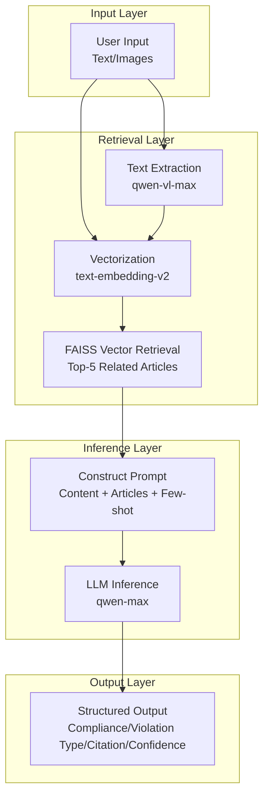

# Insurance Marketing Content Review System

[中文](README.md) | **English**

> An LLM-powered compliance review system for insurance marketing content, automatically detecting violations in marketing copy, posters, and scripts


## ✨ Core Features

- ✅ **Automated Compliance Detection**: Input marketing content for automatic violation detection
- ✅ **Violation Type Recognition**: Identifies 7 violation types (exaggerated returns, false advertising, etc.), supports multiple simultaneous violations
- ✅ **Regulatory Citation**: Precisely cites specific regulation IDs and original text
- ✅ **Confidence Scoring**: Provides confidence scores between 0-1
- ✅ **Multimodal Support**: Supports text and image content review (Web interface supports image upload)
- ✅ **Per-Image Review**: When uploading multiple images, displays individual review results for each image (compliant/violation, violation type, reasoning)
- ✅ **RAG Enhancement**: Vector retrieval of relevant regulations to improve accuracy
- ✅ **Complete Knowledge Base**: Contains 3 core regulatory documents with 134 regulatory articles

## 🛠️ Tech Stack

- **Python 3.9+** - Core language
- **Alibaba Cloud Dashscope API** - qwen-max + text-embedding-v2
- **FAISS-CPU** - Vector retrieval, no GPU required
- **FastAPI + Uvicorn** - Lightweight web service
- **Tailwind CSS (CDN)** - Pure HTML frontend, no Node.js build required

## 📋 Requirements Implementation

This project fully implements all required features:

| Requirement | Implementation | Description |
|------------|---------------|-------------|
| Text/Image Input | ✅ | Supports pure text, single image, multi-image mixed review |
| Compliance Output | ✅ | Returns compliance: true/false |
| Violation Type Recognition | ✅ | Supports 7 violation types, can identify multiple simultaneously |
| Regulation Citation | ✅ | Precisely cites regulation ID, original text, relevance score |
| Dashscope LLM | ✅ | qwen-max + qwen-vl-max + text-embedding-v2 |
| RAG Enhancement | ✅ | FAISS vector retrieval + similarity matching |
| Prompt Engineering | ✅ | Carefully designed system prompts and Few-shot examples |
| Effect Evaluation | ✅ | Complete evaluation module, supports accuracy/recall/F1 |
| Three Regulatory Documents | ✅ | Complete parsing and knowledge base construction (134 regulatory articles) |

## ⚡ Quick Start (3 Steps)

### Environment Requirements

- **Python**: 3.9 or higher
- **OS**: macOS, Linux, Windows (requires Git Bash or WSL)
- **Network**: Access to Alibaba Cloud Dashscope API
- **Disk**: ~500MB (including dependencies and vector database)

### Startup Steps

```bash
# 1. Clone the project
git clone https://github.com/mzwei09/insurance-content-review-system.git
cd insurance-content-review-system

# 2. One-click start (auto-install dependencies, initialize database, build knowledge base, start service)
bash start.sh

# 3. Visit <http://localhost:8000> in your browser 🎉
```

> 💡 **Tip**: If you forked this project, replace `mzwei09` with your GitHub username in the clone URL

### Verification Steps

After successful startup, verify with these steps:

1. **Health Check**: Visit <http://localhost:8000/api/health>, should return `{"status":"ok"}`
2. **API Documentation**: Visit <http://localhost:8000/docs> to view complete API documentation
3. **Frontend Interface**: Visit <http://localhost:8000>, register and login, configure API key, then start reviewing

### Common Startup Errors

| Error | Possible Cause | Solution |
|-------|---------------|----------|
| `ModuleNotFoundError` | Dependencies not installed | Manually run `pip install -r requirements.txt` and retry |
| `Address already in use` | Port 8000 occupied | Use `bash start.sh --port 8001` or stop the occupying process (see Port Configuration below) |
| `401 Unauthorized` | API key not configured or invalid | Configure correct Dashscope API key in Personal Center |
| `Bad CPU type in executable` | Apple Silicon architecture mismatch | Use `brew install python@3.12` to install ARM64 native Python |

### 🔧 Command Line Arguments

```bash
# View help
bash start.sh --help

# Specify port
bash start.sh --port 8001

# Use environment variable
PORT=8001 bash start.sh
```

### 🔌 Port Configuration

**Default Port**: 8000

**Port Configuration Priority** (high to low):
1. Command line argument: `--port 8001`
2. Environment variable: `PORT=8001`
3. Config file: `server.port` in `config.yaml`
4. Default value: `8000`

**If port is occupied**:

```bash
# Option 1: Use another port
bash start.sh --port 8001

# Option 2: Stop the occupying process
lsof -ti:8000 | xargs kill -9

# Option 3: Modify config file
# Edit server.port in config.yaml
```

**Graceful Exit**: Press `Ctrl+C` to automatically release the port

### 📋 Usage Flow

1. **Register**: First-time users please register an account
2. **Login**: Login with username and password
3. **Configure API Key**: Go to "Personal Center" → Enter Dashscope API key → Save and verify
4. **Review**: Return to homepage, input marketing content for compliance review

> ⚠️ **Note**: If you encounter `401 Unauthorized` error, the API key is incorrectly configured. Please reconfigure the correct key in Personal Center.
> 
> To reset database (clear all users):
> ```bash
> python3 scripts/reset_database.py
> ```

### 🔑 How to Get Dashscope API Key?

1. Visit: <https://dashscope.console.aliyun.com/apiKey>
2. Login to Alibaba Cloud account (free registration available)
3. Click "Create New API-KEY"
4. Copy the key (format: `sk-xxxxxx`)
5. Paste and save in Web interface "Personal Center"

**Free Quota**: New users have free call quota, sufficient for demo demonstration.

**Estimated Deployment Time**: 5-10 minutes (including dependency installation)

### 💻 Cross-Platform Support

| Platform | Support | Description |
|----------|---------|-------------|
| **macOS** | ✅ Fully Supported | Out of the box |
| **Linux** | ✅ Fully Supported | Out of the box |
| **Windows** | ✅ Supported | Requires Git Bash or WSL |

**Windows Users**:
- **Recommended**: Use [WSL](https://docs.microsoft.com/en-us/windows/wsl/install) (Windows Subsystem for Linux)
- **Alternative**: Install [Git for Windows](https://git-scm.com/download/win) (includes Git Bash)

### 🍎 Apple Silicon (ARM64) Architecture Notes

If you encounter `numpy` or `faiss` architecture mismatch errors on Mac (M1/M2/M3) (like `Bad CPU type in executable`), please use ARM64 native Python:

- **Recommended**: Install Homebrew ARM64 Python: `brew install python@3.12`, `start.sh` will auto-detect and use it
- **Alternative**: Force ARM64 with system Python: `arch -arm64 /usr/bin/python3 -m pip install -r requirements.txt`, then `arch -arm64 /usr/bin/python3 -m uvicorn src.api.main:app --host 0.0.0.0 --port 8000`

## 🏗️ System Architecture

### Overall Architecture Diagram



### Core Technical Paths

1. **RAG (Retrieval-Augmented Generation)**
   - Vectorization: Use text-embedding-v2 to vectorize 134 regulatory articles
   - Retrieval: FAISS vector database, cosine similarity matching
   - Enhancement: Inject Top-5 related articles into Prompt

2. **Prompt Engineering**
   - System prompt: Clear role definition and review principles
   - Few-shot examples: Provide positive/negative samples to guide inference
   - Structured output: JSON format, includes all required fields

3. **Multi-Agent Collaboration** (optional extension)
   - Coordinator Agent: Task decomposition and result aggregation
   - Text Review Agent: Text content review
   - Image Review Agent: Image OCR and review
   - Knowledge Retrieval Agent: Vector retrieval service

### Key Design Decisions

| Design Point | Choice | Reason |
|-------------|--------|--------|
| Vector Database | FAISS-CPU | Lightweight, fast, no GPU required |
| LLM | qwen-max | Strong inference capability, supports long text |
| Multimodal | qwen-vl-max | High accuracy in image text extraction |
| Web Framework | FastAPI | Async high performance, automatic documentation |
| Frontend | Pure HTML+Tailwind | No build required, out of the box |

### Core Workflow

1. **Document Parsing**: Parse PDF/DOC/DOCX regulatory documents, extract articles
2. **Vectorization**: Build FAISS index using Dashscope Embedding API
3. **RAG Retrieval**: Retrieve Top-K related articles based on input content
4. **LLM Inference**: Make compliance judgment combined with retrieved articles
5. **Result Output**: Return structured review results

See [Architecture Documentation](docs/architecture.md) for details.

## Usage Instructions

### Start Service

```bash
# Method 1: Use startup script (recommended, includes dependency check and knowledge base construction)
bash start.sh

# Method 2: Start API only (development mode, supports hot reload, requires prior dependency installation and knowledge base construction)
bash scripts/start_server.sh
```

### Access Interface

After successful startup, visit in browser:

- **Frontend Interface**: <http://localhost:8000>
- **Health Check**: <http://localhost:8000/api/health>
- **API Documentation**: <http://localhost:8000/docs>

### API Documentation

#### 1. Text Review Endpoint

**POST** `/api/review`

Request body:

```json
{
  "content": "Text to review"
}
```

Response example:

```json
{
  "success": true,
  "data": {
    "compliance": false,
    "violation_types": ["Exaggerated Returns", "Illegal Promise"],
    "violation_type": "Exaggerated Returns",
    "cited_articles": [
      {
        "article_id": "Article 23",
        "article_text": "Insurance sales personnel shall not exaggerate insurance product returns...",
        "relevance_score": 0.92
      }
    ],
    "confidence": 0.88,
    "reasoning": "Content contains multiple violations: 1) 'Returns up to 15%' is exaggerated returns; 2) 'Guaranteed profit' is illegal promise..."
  },
  "error": null
}
```

**Note**:
- `violation_types`: Array, contains all violation types (supports multiple)
- `violation_type`: String, backward compatible, takes first violation type

#### 2. Multimodal Review Endpoint

**POST** `/api/review-multimodal`

Request format: `multipart/form-data`

Parameters:
- `text` (optional): Text content
- `images` (optional): Image file list (supports multiple images)

Response format same as `/api/review`.

**Use Cases**:
- Review marketing posters with images
- Review WeChat Moments content with mixed text and images
- Extract text from images and perform compliance review

**Example (curl)**:

```bash
curl -X POST http://localhost:8000/api/review-multimodal \
  -H "Authorization: Bearer YOUR_JWT_TOKEN" \
  -F "text=Check the insurance product promotion in the image" \
  -F "images=@poster.jpg"
```

#### 3. Health Check

**GET** `/api/health`

Response: `{"status": "ok"}`

### Knowledge Base Construction

The system includes 3 core regulatory documents (134 regulatory articles total):
- "Insurance Sales Behavior Management Measures" (8 articles)
- "Financial Product Online Marketing Management Measures (Draft for Comments)" (40 articles)
- "Internet Insurance Business Supervision Measures" (86 articles)

To rebuild the knowledge base:

```bash
python scripts/build_knowledge_base.py
```

### Configuration Instructions

- `config.yaml`: Model, vector database, retrieval, authentication, database, etc. configuration
- `.env.example`: Environment variable template, copy to `.env` and fill in `DASHSCOPE_API_KEY` (optional, can also configure in Web interface Personal Center)
- **Production Deployment**: Please modify `auth.secret_key` in `config.yaml`, do not use default value

## 📁 Project Structure

```
aireviewsystem/
├── README.md                    # Project documentation (Chinese)
├── README_EN.md                 # Project documentation (English)
├── requirements.txt             # Python dependencies
├── config.yaml                  # System configuration
├── start.sh                     # One-click startup script
│
├── src/                         # Core code
│   ├── document_parser.py       # Document parsing (PDF/DOC/DOCX)
│   ├── vectorstore.py           # FAISS vector database
│   ├── retriever.py             # RAG retrieval
│   ├── llm_client.py            # Dashscope API client
│   ├── reviewer.py              # Review core logic
│   ├── multimodal_reviewer.py   # Multimodal review
│   ├── evaluator.py             # Effect evaluation
│   └── api/main.py              # FastAPI entry point
│
├── prompts/review_prompt.txt    # Prompt template
│
├── scripts/                     # Utility scripts
│   ├── build_knowledge_base.py  # Build vector database
│   ├── run_evaluation.py        # Run evaluation
│   ├── init_database.py         # Initialize database
│   ├── reset_database.py        # Reset database
│   └── start_server.sh          # Development mode startup
│
├── tests/                       # Test code
│   ├── test_reviewer.py         # Unit tests
│   └── test_integration.py      # Integration tests
│
├── data/                        # Data directory
│   ├── documents/               # Regulatory documents (PDF/DOCX)
│   ├── knowledge_base.json      # Knowledge base JSON
│   ├── vectorstore/             # Vector database storage (generated by script)
│   └── test_cases/              # Test dataset
│
├── frontend/index.html          # Frontend interface (pure HTML)
│
├── docs/                        # Documentation
│   ├── architecture.md          # Architecture design
│   └── PERFORMANCE_ANALYSIS.md  # Performance analysis
│
└── reports/                     # Evaluation reports (generated by script)
    ├── evaluation_report.html
    └── evaluation_report.md
```

## 🧪 Test Case Usage Guide

### Test Images

The project provides 5 test images in the `test_images/` directory:

| Image | Type | Expected Result | Violation Type |
|-------|------|----------------|----------------|
| 1_违规_夸大收益.png | Violation | ❌ | Exaggerated Returns, Illegal Promise |
| 2_违规_明星代言.png | Violation | ❌ | Unqualified Endorsement, Misleading Statement |
| 3_合规_产品介绍.png | Compliant | ✅ | - |
| 4_合规_风险提示.png | Compliant | ✅ | - |
| 5_违规_误导陈述.png | Violation | ❌ | Misleading Statement, Exaggerated Returns, Illegal Promise |

### Test Case Set

Located at `data/test_cases/test_cases.json`, contains:

- 30+ carefully designed test cases
- Covers 7 violation types
- Includes positive and negative samples

### Run Evaluation

```bash
# Run complete evaluation
python scripts/run_evaluation.py

# View evaluation report
open reports/evaluation_report.html
# Or view Markdown report
cat reports/evaluation_report.md
```

### Manual Testing

1. Start service: `bash start.sh`
2. Visit: <http://localhost:8000>
3. Click "Example" button for quick test
4. Or upload images from `test_images/`

## 📊 Effect Evaluation

### Evaluation Metrics

Run `python scripts/run_evaluation.py` to get evaluation report, typical metrics example:

| Metric | Description |
|--------|-------------|
| Accuracy | Correct compliance judgments / Total |
| Macro-average Precision | Macro-average across violation types |
| Macro-average Recall | Macro-average across violation types |
| Macro-average F1 | Macro-average across violation types |
| Article Citation Accuracy | Correct citations / Total citations |

> Specific values based on actual run of `python scripts/run_evaluation.py` generated `reports/evaluation_report.html`.

### Evaluation Method

- **Test Set**: 30+ annotated samples
- **Evaluation Dimensions**:
  - Compliance judgment accuracy
  - Violation type recognition accuracy
  - Article citation relevance
- **Evaluation Script**: `scripts/run_evaluation.py`
- **Evaluation Report**: Auto-generated in `reports/` directory

## 🎬 Demo

### Interface Preview

<table>
<tr>
<td width="33%"><b>Login Page</b><br/></td>
<td width="33%"><b>Register Page</b><br/></td>
<td width="33%"><b>Review Page</b><br/></td>
</tr>
<tr>
<td width="33%"><b>Text Review Result</b><br/></td>
<td width="33%"><b>Image Review Result</b><br/></td>
<td width="33%"><b>Personal Center</b><br/></td>
</tr>
</table>

### Web Interface
Visit <http://localhost:8000>, input content to review

### Command Line Demo
Test review endpoints via API documentation (<http://localhost:8000/docs>) or curl.

### Effect Evaluation

```bash
python3 scripts/run_evaluation.py
open reports/evaluation_report.html
```

See [📊 Effect Evaluation](#-effect-evaluation) section for details.

### View LLM Call Logs
```bash
# Real-time view of complete logs (including LLM input/output)
tail -f logs/app.log

# View LLM-related logs only
tail -f logs/app.log | grep -E "🤖|📝|📤|审核结果"
```

**Log Content**:
- 🔎 Vector retrieval process
- 🤖 LLM API calls
- 📝 Complete Prompt sent (System + User)
- 📤 JSON output returned by LLM
- 📊 Review result summary

(Optional) Run `scripts/run_evaluation.py` to generate evaluation report.

## 🧪 Testing

### Run Tests

```bash
# Run all tests (requires pip install -r requirements.txt first)
pytest tests/ -v
# Or: python -m pytest tests/ -v

# Run unit tests
pytest tests/test_reviewer.py -v

# Run integration tests
pytest tests/test_integration.py -v
```

### Effect Evaluation

Run `python scripts/run_evaluation.py` for effect evaluation, see [📊 Effect Evaluation](#-effect-evaluation) section above.

## 📚 Documentation

- [Architecture Documentation](docs/architecture.md) - System architecture design
- [Project Structure](PROJECT_STRUCTURE.md) - Code organization description
- [Acceptance Guide](ACCEPTANCE_GUIDE.md) - Feature acceptance steps
- [Screenshot Guide](docs/SCREENSHOT_GUIDE.md) - Interface screenshot generation instructions

## ⚠️ Common Issues

### 1. numpy/faiss Architecture Mismatch (Apple Silicon)

**Symptom**: `ImportError: dlopen ... (mach-o file, but is an incompatible architecture)`

**Solution**:
```bash
# Option 1: Use Homebrew Python (recommended)
brew install python@3.12
/usr/local/bin/python3.12 -m pip install -r requirements.txt
/usr/local/bin/python3.12 -m uvicorn src.api.main:app --host 0.0.0.0 --port 8000

# Option 2: Force ARM64 architecture
arch -arm64 /usr/bin/python3 -m pip install --upgrade pip
arch -arm64 /usr/bin/python3 -m pip install -r requirements.txt
arch -arm64 /usr/bin/python3 -m uvicorn src.api.main:app --host 0.0.0.0 --port 8000
```

The `start.sh` script has automatic architecture detection.

### 2. Service Startup Failure

**Troubleshooting Steps**:
```bash
# Check port occupation
lsof -i :8000

# View logs
tail -f logs/app.log

# Test Python imports
python3 -c "import numpy, faiss; print('OK')"
```

### 3. Invalid API Key

- Confirm key format: starts with `sk-`
- Check if key is expired
- Visit <https://dashscope.console.aliyun.com/apiKey> to regenerate

## 🤝 Contributing

Issues and Pull Requests are welcome.

## 📄 License

MIT License
