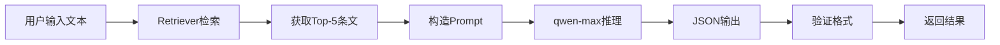
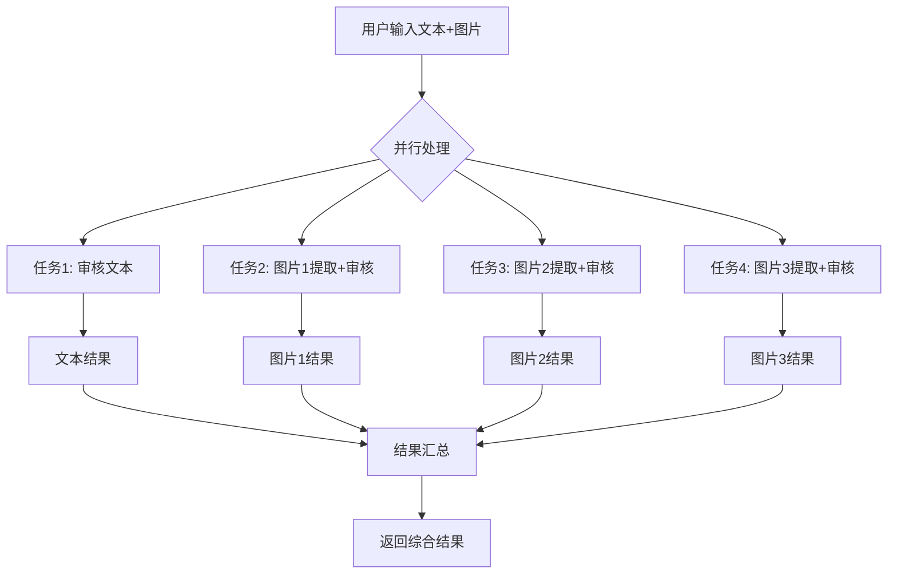

# Agent 架构设计文档

## 📐 当前架构概览

本项目采用 **单体式 Agent 架构 + RAG 增强**，而非传统的多 Agent 协作架构。这是一个经过深思熟虑的设计决策。

## 🏗️ 架构类型：单体式 Agent (Monolithic Agent)

### 核心设计

```
┌─────────────────────────────────────────────────────────┐
│              ContentReviewer (核心 Agent)                │
│                                                          │
│  ┌──────────────┐  ┌──────────────┐  ┌──────────────┐  │
│  │   Retriever  │  │  LLM Client  │  │ VectorStore  │  │
│  │  (检索模块)   │  │  (推理模块)   │  │  (知识库)    │  │
│  └──────────────┘  └──────────────┘  └──────────────┘  │
│                                                          │
│  输入 → RAG检索 → Prompt构造 → LLM推理 → 结构化输出      │
└─────────────────────────────────────────────────────────┘
                            ↓
┌─────────────────────────────────────────────────────────┐
│         MultimodalReviewer (多模态扩展)                  │
│                                                          │
│  图片 → 文字提取(qwen-vl-max) → ContentReviewer          │
│  文本 → ContentReviewer                                  │
│  并行处理 → 结果汇总                                      │
└─────────────────────────────────────────────────────────┘
```

## 🎯 为什么选择单体式而非多 Agent？

### 优势分析

| 维度 | 单体式 Agent | 多 Agent 协作 | 我们的选择 |
|------|-------------|--------------|-----------|
| **复杂度** | 低，易维护 | 高，需要协调逻辑 | ✅ 单体式 |
| **性能** | 快，无通信开销 | 慢，Agent 间通信 | ✅ 单体式 |
| **成本** | 低，单次 LLM 调用 | 高，多次 LLM 调用 | ✅ 单体式 |
| **可控性** | 高，流程确定 | 低，依赖 Agent 决策 | ✅ 单体式 |
| **扩展性** | 中等 | 高，易添加新 Agent | - |

### 适用场景

**单体式 Agent 适合**（✅ 我们的场景）:
- 任务流程固定、清晰
- 不需要复杂的任务分解和协调
- 对性能和成本敏感
- 需要确定性的输出

**多 Agent 适合**:
- 任务复杂、需要动态分解
- 不同子任务需要不同专业能力
- 需要自主决策和协调
- 对成本不敏感

## 🔧 核心组件详解

### 1. ContentReviewer (核心审核 Agent)

**职责**: 文本内容的合规审核

**能力**:
- ✅ RAG 检索相关监管条文
- ✅ 构造审核 Prompt（System + User + Few-shot）
- ✅ 调用 LLM 进行推理
- ✅ 解析和验证 JSON 输出
- ✅ 多违规类型识别

**关键方法**:
```python
def review(self, content: str, api_key: Optional[str] = None) -> dict:
    # 1. RAG 检索
    articles = self.retriever.retrieve(content, api_key=api_key)
    
    # 2. 构造 Prompt
    prompt = self._build_prompt(content, articles)
    
    # 3. LLM 推理
    response = call_llm_json(prompt, api_key=api_key)
    
    # 4. 验证输出
    return self._validate_review_output(response)
```

**输入**: 文本内容
**输出**: 
```json
{
  "compliance": false,
  "violation_types": ["夸大收益", "违规承诺"],
  "cited_articles": [...],
  "confidence": 0.88,
  "reasoning": "..."
}
```

### 2. MultimodalReviewer (多模态扩展)

**职责**: 图文混合内容的审核

**能力**:
- ✅ 继承 ContentReviewer 的所有能力
- ✅ 图片文字提取（qwen-vl-max）
- ✅ 并行处理多张图片
- ✅ 逐张审核 + 结果汇总
- ✅ 流式进度回调

**处理流程**:
```python
def _review_detailed(self, text, image_urls, api_key, progress_callback):
    # 使用 ThreadPoolExecutor 并行处理
    with ThreadPoolExecutor(max_workers=6) as executor:
        # 任务1: 审核文本
        if text:
            futures[executor.submit(review_text)] = "text"
        
        # 任务2-N: 并行审核所有图片
        for idx, img_url in enumerate(image_urls, 1):
            futures[executor.submit(review_image, idx, img_url)] = f"image_{idx}"
        
        # 实时获取完成的任务
        for future in as_completed(futures):
            result = future.result()
            if progress_callback:
                progress_callback({"type": "result", "data": result})
    
    # 汇总所有结果
    return aggregate_results(text_result, image_results)
```

**输入**: 文本 + 图片列表
**输出**:
```json
{
  "compliance": false,
  "violation_types": ["夸大收益", "明星代言"],
  "text_result": {...},      // 文本审核详情
  "image_results": [         // 每张图片审核详情
    {"image_index": 1, "compliance": false, ...},
    {"image_index": 2, "compliance": true, ...}
  ],
  "reasoning": "【文本】...\n【图片1】...\n【图片2】..."
}
```

### 3. Retriever (检索 Agent)

**职责**: RAG 检索相关监管条文

**能力**:
- ✅ 向量相似度检索
- ✅ 相关度阈值过滤
- ✅ Top-K 结果排序

**流程**:
```python
def retrieve(self, query: str, top_k: int = 5) -> list[dict]:
    # 1. 向量检索
    results = self.vectorstore.search(query, top_k)
    
    # 2. 过滤低相关度
    filtered = [r for r in results if r[1] >= self.score_threshold]
    
    # 3. 格式化输出
    return [{"article_id": ..., "article_text": ..., "relevance_score": ...}]
```

### 4. LLM Client (推理引擎)

**职责**: 调用百炼大模型 API

**支持的模型**:
- `qwen-max`: 文本推理（合规判断）
- `qwen-vl-max`: 多模态（图片文字提取）
- `text-embedding-v2`: 文本向量化

**核心功能**:
```python
def call_llm_json(messages: list, model: str = "qwen-max", api_key: str = None):
    # 1. 调用 OpenAI 兼容接口
    response = client.chat.completions.create(
        model=model,
        messages=messages,
        response_format={"type": "json_object"}
    )
    
    # 2. 解析 JSON 输出
    return json.loads(response.choices[0].message.content)
```

## 🔄 完整审核流程

### 文本审核流程



**时间**: ~2-3 秒

### 图文混合审核流程（并行优化）



**时间**: ~5-8 秒（3张图片）
**提升**: 相比串行快 60-70%

## 🎭 是否需要多 Agent 架构？

### 当前架构的充分性

我们的单体式 Agent 已经足够强大，因为：

1. **任务单一明确**: 合规审核，不需要复杂的任务分解
2. **流程固定**: 检索 → 推理 → 输出，无需动态决策
3. **性能优先**: 单次 LLM 调用，成本低、速度快
4. **可维护性**: 代码简洁，逻辑清晰

### 如果需要多 Agent，可以这样扩展

#### 方案 A: 专业化 Agent 分工

```
┌─────────────────────────────────────────────────────────┐
│                  Coordinator Agent                       │
│                  (任务协调器)                             │
└─────────────────────────────────────────────────────────┘
                            ↓
        ┌───────────────────┼───────────────────┐
        ↓                   ↓                   ↓
┌──────────────┐  ┌──────────────┐  ┌──────────────┐
│ Text Review  │  │ Image Review │  │  Knowledge   │
│    Agent     │  │    Agent     │  │   Retrieval  │
│              │  │              │  │    Agent     │
│ (文本审核)    │  │ (图片审核)    │  │  (知识检索)   │
└──────────────┘  └──────────────┘  └──────────────┘
        ↓                   ↓                   ↓
        └───────────────────┼───────────────────┘
                            ↓
                  ┌──────────────┐
                  │   Aggregator │
                  │     Agent    │
                  │  (结果汇总)   │
                  └──────────────┘
```

**优点**:
- 每个 Agent 专注单一任务
- 易于独立优化和测试
- 可以使用不同的 LLM 模型

**缺点**:
- 复杂度高（需要 Coordinator）
- 成本高（多次 LLM 调用）
- 延迟高（Agent 间通信）

#### 方案 B: 分层 Agent 架构

```
┌─────────────────────────────────────────────────────────┐
│                 L1: Screening Agent                      │
│                 (初筛 Agent - 快速过滤)                   │
│                 使用简单规则或小模型                       │
└─────────────────────────────────────────────────────────┘
                            ↓
                    疑似违规？
                            ↓ Yes
┌─────────────────────────────────────────────────────────┐
│                 L2: Review Agent                         │
│                 (精审 Agent - 深度分析)                   │
│                 使用 RAG + 大模型                         │
└─────────────────────────────────────────────────────────┘
                            ↓
┌─────────────────────────────────────────────────────────┐
│                 L3: Appeal Agent (可选)                  │
│                 (复审 Agent - 二次确认)                   │
│                 使用更强大的模型或人工审核                 │
└─────────────────────────────────────────────────────────┘
```

**优点**:
- 成本优化（大部分合规内容快速过滤）
- 准确率高（疑似案例深度分析）

**缺点**:
- 复杂度高
- 需要维护多个模型
- 初筛规则需要持续优化

## 🔍 当前架构的组件分析

### 组件 1: ContentReviewer (核心 Agent)

**定位**: 单一职责的审核 Agent

**内部能力**:
- **感知**: 接收文本输入
- **记忆**: 加载监管条文知识库（FAISS）
- **推理**: 
  1. 检索相关条文（RAG）
  2. 构造审核 Prompt
  3. 调用 LLM 推理
  4. 解析和验证输出
- **行动**: 返回结构化审核结果

**代码位置**: `src/reviewer.py`

**关键特性**:
- ✅ Prompt Engineering（System + User + Few-shot）
- ✅ 结构化输出（JSON Schema 验证）
- ✅ 多违规类型识别
- ✅ 条文引用准确性

### 组件 2: MultimodalReviewer (扩展 Agent)

**定位**: ContentReviewer 的多模态扩展

**设计模式**: 继承 + 组合

```python
class MultimodalReviewer(ContentReviewer):
    def review(self, content, image_urls, ...):
        # 1. 图片文字提取（新增能力）
        image_text = extract_text_from_images(image_urls)
        
        # 2. 复用父类审核能力
        return super().review(combined_content)
```

**并行优化**:
```python
# 使用 ThreadPoolExecutor 并行处理
with ThreadPoolExecutor(max_workers=6) as executor:
    # 文本 + 图片1 + 图片2 + ... 同时处理
    futures = {
        executor.submit(review_text): "text",
        executor.submit(review_image, 1): "image_1",
        executor.submit(review_image, 2): "image_2",
        ...
    }
    
    # 实时获取完成的任务（支持流式）
    for future in as_completed(futures):
        result = future.result()
        if progress_callback:
            progress_callback(result)  # 流式推送
```

**代码位置**: `src/multimodal_reviewer.py`

### 组件 3: Retriever (检索模块)

**定位**: 专门的知识检索组件（不是独立 Agent）

**职责**:
- 向量相似度检索
- 相关度阈值过滤
- 结果格式化

**为什么不是独立 Agent？**
- 功能单一，不需要 LLM 推理
- 纯计算任务，无需"智能"决策
- 作为 ContentReviewer 的工具即可

**代码位置**: `src/retriever.py`

### 组件 4: LLM Client (推理引擎)

**定位**: LLM API 的封装层

**职责**:
- 调用百炼 API
- 处理重试和错误
- 日志记录

**为什么不是独立 Agent？**
- 纯工具类，无业务逻辑
- 多个组件共享使用

**代码位置**: `src/llm_client.py`

## 🌊 流式架构 (Streaming Architecture)

### 设计目标

在保持单体式 Agent 架构的同时，支持流式进度推送。

### 实现方式

#### 后端: 进度回调 + SSE

```python
def _review_detailed(self, ..., progress_callback):
    # 每个任务完成时回调
    def review_image(idx, img_url):
        progress_callback({"type": "progress", "message": f"正在审核图片{idx}..."})
        result = super().review(img_text)
        progress_callback({"type": "image_result", "result": result})
        return result
    
    # 并行执行
    with ThreadPoolExecutor() as executor:
        ...
```

**API 端点**: `/api/review-multimodal-stream`

**输出格式**: Server-Sent Events (SSE)
```
event: progress
data: {"type":"progress","message":"正在审核文本内容..."}

event: text_result
data: {"type":"text_result","result":{...}}

event: image_result
data: {"type":"image_result","image_index":1,"result":{...}}

event: complete
data: {"type":"complete","result":{...}}
```

#### 前端: EventSource 消费

```javascript
async function startStreamReview() {
    const response = await fetch('/api/review-multimodal-stream', {...});
    const reader = response.body.getReader();
    
    while (true) {
        const { done, value } = await reader.read();
        if (done) break;
        
        // 解析 SSE 事件
        const events = parseSSE(value);
        events.forEach(event => {
            if (event.type === 'progress') {
                updateProgressUI(event.message);
            } else if (event.type === 'image_result') {
                appendImageResult(event.result);  // 立即显示
            } else if (event.type === 'complete') {
                showFinalResult(event.result);
            }
        });
    }
}
```

### 流式架构的优势

1. **实时反馈**: 用户可以看到每个步骤的进度
2. **渐进式展示**: 不用等待全部完成，结果逐步显示
3. **更好体验**: 感知等待时间更短
4. **可取消**: 用户可以随时中断

## 📊 架构对比：当前 vs 多 Agent

### 当前架构（单体式 + 流式）

```
用户请求
    ↓
ContentReviewer (单一 Agent)
    ├─ Retriever (工具)
    ├─ LLM Client (工具)
    └─ VectorStore (知识库)
    ↓
结构化输出（一次性或流式）
```

**特点**:
- 1 个核心 Agent
- 2-3 次 LLM 调用（文本审核 + 图片提取）
- 流程确定，无协调开销
- 性能优化：并行处理

### 多 Agent 架构（假设）

```
用户请求
    ↓
Coordinator Agent (协调器)
    ↓
    ├─ Knowledge Agent (检索条文)
    ├─ Text Review Agent (审核文本)
    ├─ Image Review Agent (审核图片)
    └─ Citation Agent (验证引用)
    ↓
Aggregator Agent (汇总结果)
    ↓
结构化输出
```

**特点**:
- 5-6 个 Agent
- 8-12 次 LLM 调用
- 需要 Agent 间通信协议
- 灵活但成本高

## 🎯 架构选择的合理性

### 为什么当前架构是最优的？

1. **任务特性匹配**
   - 合规审核是**单一、明确**的任务
   - 不需要复杂的任务分解
   - 流程固定：检索 → 推理 → 输出

2. **性能要求**
   - 用户期望快速响应（< 10秒）
   - 多 Agent 通信开销会拖慢速度
   - 并行处理已经足够优化性能

3. **成本考虑**
   - 每次审核只需 2-3 次 LLM 调用
   - 多 Agent 架构可能需要 10+ 次调用
   - 对于高频使用场景，成本差异显著

4. **可维护性**
   - 单体式代码结构清晰
   - 易于调试和测试
   - 降低团队学习成本

## 🚀 未来扩展方向

如果业务复杂度增加，可以考虑以下扩展：

### 1. 专家 Agent 系统

针对不同保险类型（重疾险、医疗险、年金险等）训练专门的 Agent：

```
Coordinator
    ├─ 重疾险专家 Agent
    ├─ 医疗险专家 Agent
    └─ 年金险专家 Agent
```

### 2. 分层审核系统

```
L1: 快速初筛 Agent (规则引擎)
    ↓ 疑似违规
L2: 深度审核 Agent (RAG + LLM)
    ↓ 高风险
L3: 人工复审 Agent (人机协作)
```

### 3. 自我反思 Agent

```
Review Agent → 输出结果
    ↓
Reflection Agent → 检查推理逻辑
    ↓
Refinement Agent → 优化输出
```

### 4. 多模型集成

```
Ensemble Coordinator
    ├─ qwen-max Agent
    ├─ gpt-4 Agent
    └─ claude Agent
    ↓
投票或加权融合
```

## 📁 相关文件

- `src/reviewer.py` - ContentReviewer 核心实现
- `src/multimodal_reviewer.py` - MultimodalReviewer 扩展
- `src/retriever.py` - 检索模块
- `src/llm_client.py` - LLM 客户端
- `src/api/main.py` - API 层（含流式端点）
- `docs/architecture.md` - 系统架构文档
- `docs/STREAMING_AND_PERFORMANCE.md` - 流式与性能优化

## 🎓 架构设计原则

1. **KISS (Keep It Simple, Stupid)**: 简单优于复杂
2. **YAGNI (You Aren't Gonna Need It)**: 不过度设计
3. **Performance First**: 性能优先
4. **Cost Awareness**: 成本意识
5. **User Experience**: 用户体验至上

## 📝 总结

当前项目采用的是 **单体式 Agent + RAG 增强 + 流式优化** 的架构：

- ✅ **简单高效**: 单一 Agent，流程清晰
- ✅ **性能优化**: 并行处理，速度提升 60-70%
- ✅ **用户体验**: 流式推送，实时反馈
- ✅ **成本可控**: 最少的 LLM 调用次数
- ✅ **易于维护**: 代码结构清晰，便于扩展

这是一个**工程化的最佳实践**，在满足业务需求的同时，保持了架构的简洁性和可维护性。

---

**结论**: 当前架构非常适合本项目的需求，无需引入多 Agent 的复杂性。如果未来业务复杂度显著增加，可以按需扩展为多 Agent 架构。
